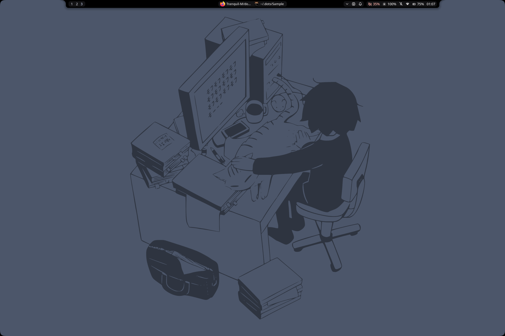
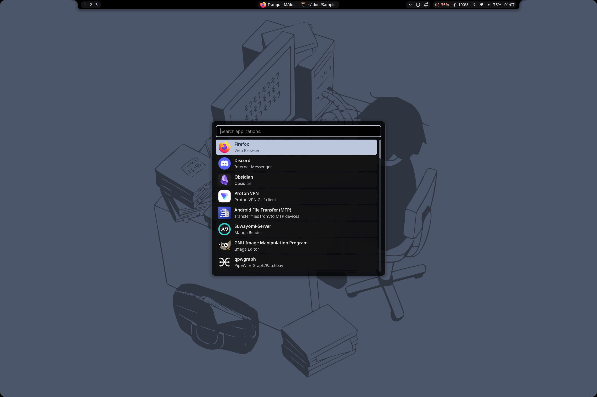
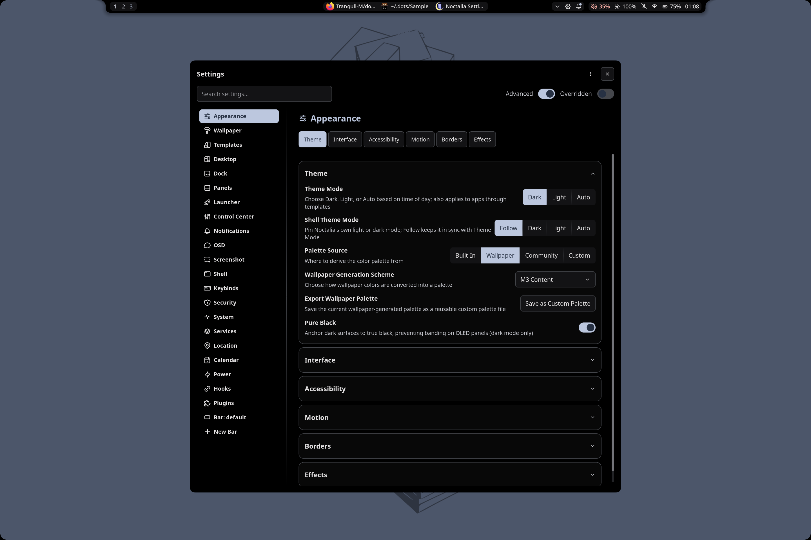
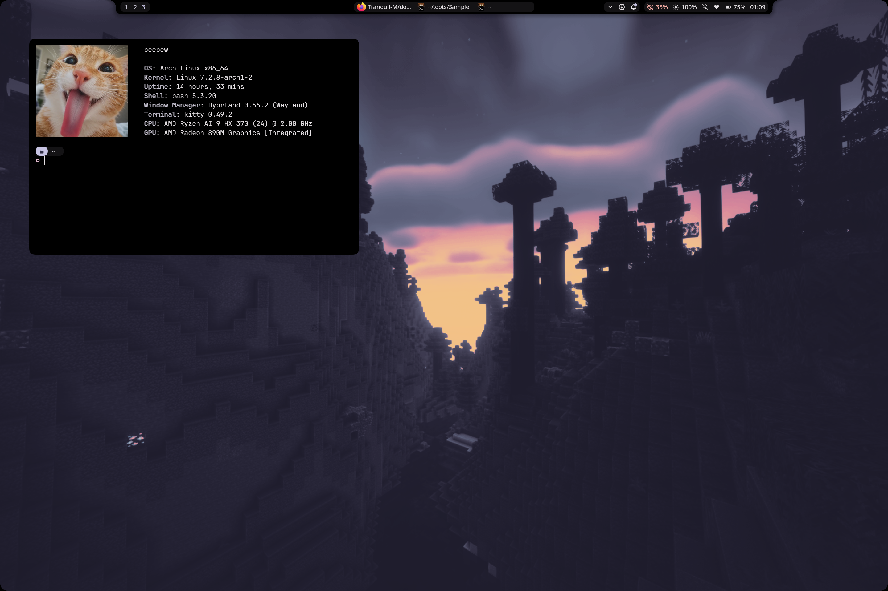
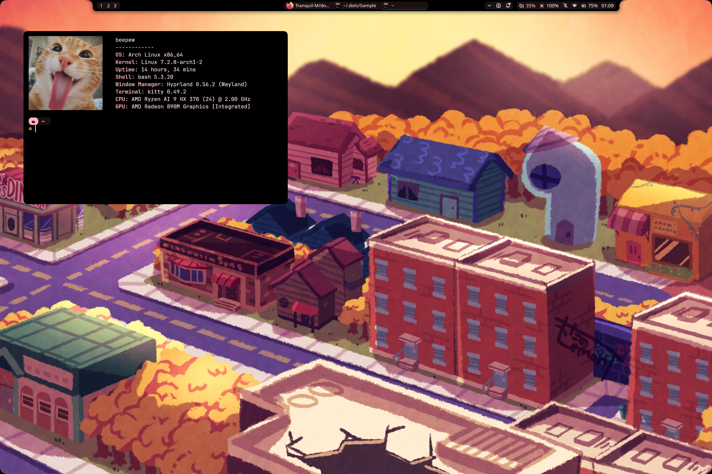
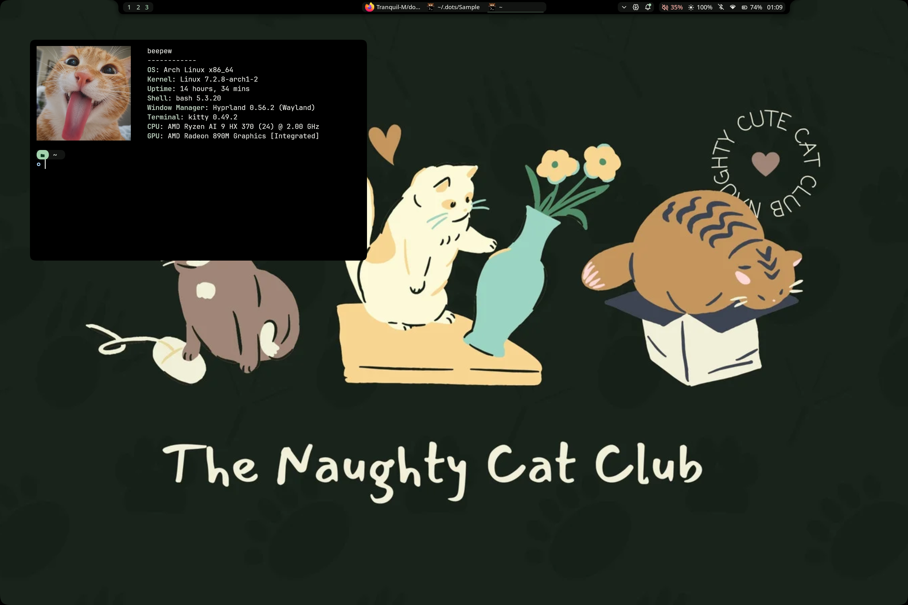

Welcome to...

# Tranquil's Hyprland Dot Files

## Table of Contents

| Category | Description |
|----------|------------|
| [How does it look?](#looks) | Images of the actual rice |
| [Installation](#install) | Directions to clone and use this repository |
| [How does the install script work?](#walkthrough) | Explanation of the install script |
| [Features](#feat) | Included features |
| [Bindings](#binds) | Keybindings list |
| [Used Packages](#pkgs) | All packages used |

<a name="looks"></a>
## How does it look?

| Desktop | Launcher |
| :---: | :---: |
|  |  |

|  Wallpaper Selector | Notification Manager |
| :---: | :---: |
|  |  |

| Lock Manager | Settings |
| :---: | :---: |
|  |  |

## Color Examples

| Minecraft Purple | Anord Pink | Cat Club Green |
| :---: | :---: | :---: |
|  |  |  |

> [!NOTE]
> All wallpaper colors are completely adaptive! It changes everything, all just depends on what wallpaper you are using.

<a name="install"></a>
## Installation

1. Execute the curl entrypoint with curl:
    ```bash
    bash <(curl -sL https://raw.githubusercontent.com/Tranquil-M/dots/refs/heads/master/scripts/curl-entrypoint.sh)
    ```

> [!IMPORTANT]
> The install script is currently only compatible with Arch Linux.

<a name="walkthrough"></a>
## How does the install script work?

**Curl Entrypoint**
1. Verifies dependencies and operating system.
2. Installs git if not present.
3. Asks user if they want to clone using HTTPS or SSH
4. Executes the dotfiles installer

**Dotfiles installer**
1. Verifies dependencies, operation system, and internet connection.
2. Installs all the neccessary packages from `packages.txt` in the project root.
3. Asks the user if they want to install am SDDM theme. This will clone [`Darkkal44's qylock`](https://github.com/Darkkal44/qylock) and run the corresponding installation script.
5. Sets default file manager, browser, etc.
6. Overwrites the current configuration in place with the new one, all synced with GNU stow.
7. Runs post-installation script such as persistent workspace creation.

>[!NOTE]
>The curl entry point is completely optional, and serves as a wrapper for ease of use.

<a name="feat"></a>
## Features

These dotfiles are meant to be simple and practical for daily use, with some additional features:

- Screenshot utility using Grim, Slurp, and Satty  
  Saves to: `~/Pictures/Screenshots`
- Noctalia
    - Wallpaper switcher
    - Application Launcher
    - Lockscreen
    - Logout Menu
    - Clipboard History
    - Tab switcher
    - Control Panel
    - On-screen display
- Custom Discord theme using Equibop (Discord Client)
- Kickstart Nvim configuration
- Exa
- Zoxide
- Firefox theme using pywal-fox and custom css  
- Qylock customizable sddm themes

<a name="binds"></a>
## Keybindings

### Core actions
- Super + Space → Open launcher
- Super + C → Open control center
- Super + S → Open settings
- Super + M → Open media panel
- Super + N → Open notification history
- Super + X → Open emoji selector via launcher
- Super + V → Open clipboard history via launcher
- Super + B → Open battery panel
- Alt + Tab → Tab Switcher

### System
- Super + A → Toggle Bar Visibility

### Applications
- Super + Enter → Open terminal
- Super + Shift + F → Open file manager
- Super + E → Toggle wallpaper

### Media controls
- Volume up key → Increase volume
- Volume down key → Decrease volume
- Mute key → Mute audio
- Brightness up key → Increase brightness
- Brightness down key → Decrease brightness
- Next track → Next song
- Play/Pause → Play or pause media
- Previous track → Previous song

### Screenshots
- Super + Z → Capture selected area
- Super + Shift + Z → Capture full screen

### Window management
- Super + W → Close active window
- Super + T → Toggle floating window
- Super + Backspace → Open session menu
- Super + F → Fullscreen mode
- Super + Alt + F → Exit fullscreen mode

### Notifications
- Super + Comma → Remove oldest notification
- Super + Shift + Comma → Clear all notifications

### Focus navigation
- Super + Arrow keys → Move focus between windows

### Move windows
- Super + Shift + Arrow keys → Move window in direction

### Workspaces
- Super + 1–0 → Switch to workspace 1–10
- Super + Shift + 1–0 → Move window to workspace 1–10
- Super + Mouse wheel → Switch workspaces

### Mouse actions
- Super + Left click drag → Move window
- Super + Right click drag → Resize window

### Window switching
- Alt + Tab → Next window
- Alt + Shift + Tab → Previous window

### Laptop
- Close lid → Lock screen and suspend system

> [!NOTE]
> Temporary workspaces are supported, but a minimum of 3 persistent workspaces are assigned per-monitor on startup.

<a name="pkgs">

## Packages

* [`Btop`](https://github.com/aristocratos/btop)
* [`GNU Stow`](https://www.gnu.org/software/stow/)
* [`Equibop`](https://equicord.org/)
* [`Exa`](https://github.com/ogham/exa)
* [`Grim`](https://github.com/emersion/grim)
* [`Kickstart`](https://github.com/nvim-lua/kickstart.nvim)
* [`Kitty`](https://sw.kovidgoyal.net/kitty/)
* [`Little Fox`](https://github.com/biglavis/LittleFox)
* [`Matugen Templates`](https://github.com/InioX/matugen-themes)
* [`Pywal-Fox`](https://addons.mozilla.org/en-US/firefox/addon/pywalfox/?utm_source=addons.mozilla.org&utm_medium=referral&utm_content=search)
* [`Satty`](https://github.com/Satty-org/Satty)
* [`Qylock`](https://github.com/Darkkal44/qylock)
* [`Slurp`](https://github.com/emersion/slurp)
* [`Zoxide`](https://github.com/ajeetdsouza/zoxide)
* [`Noctalia`](https://noctalia.dev/)

[](https://ko-fi.com/I2I61Z3QJH)
